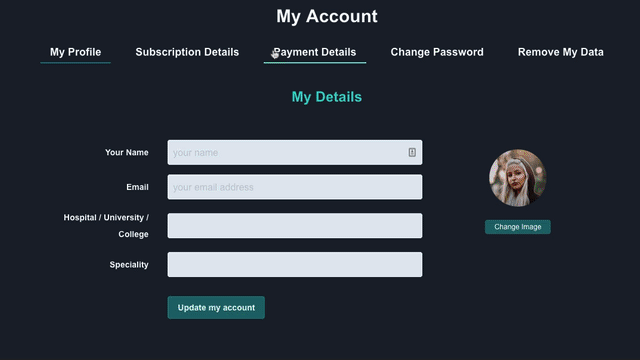

# Tabbed Content Using Alpine JS

Create the effect of tabbed page content, allowing any tab to be linked directly and validation errors returning to the same tab as the form.



## Create \<div> for each section of tabbed content

Selecting a tab will show this div's content and hide the others, creating the appearance of tabbed navigation;

```markup
<div x-show="tab == '#tab1'" x-cloak>
    <p>This is the content of Tab 1</p>
</div>

<div x-show="tab == '#tab2'" x-cloak>
    <p>This is the content of Tab 2</p>
</div>

<div x-show="tab == '#tab3'" x-cloak>
    <p>This is the content of Tab 3</p>
</div>
    
```

Name the tabs according to your use case.  Prefix the tab name with `#`, this will come in useful later


Use x-cloak to prevent all the sections from appearing before Alpine starts


## Create the navigation

Create a set of clickable anchors that will tell alpine to change the value 'tab' so that the relevant Div is shown

```markup
<div class="flex flex-row justify-between">

    <a class="px-4 border-b-2 border-gray-900 hover:border-teal-300" 
      href="#" x-on:click.prevent="tab='#tab1'">Tab1</a>
      
    <a class="px-4 border-b-2 border-gray-900 hover:border-teal-300" 
      href="#" x-on:click.prevent="tab='#tab2'">Tab2</a>
      
    <a class="px-4 border-b-2 border-gray-900 hover:border-teal-300" 
      href="#" x-on:click.prevent="tab='#tab3'">Tab3</a>
      
</div>
```

## Create Alpine scope with x-data

Wrap the whole thing within a div which contains the `x-data` tag to initialise an instance of Alpine. Set the initial value of the tab to whatever tab you want to be displayed by default (assumed to be tab 1)

```markup
<div x-data="{ tab: '#tab1' }" class="">

    <!-- Links here -->
    
    <!-- Tab Content here -->
    
</div>

```

So the variable _tab_ is set to '#tab1' .  When the Tab2 link is clicked, _tab_ will be set to '#tab2' and since that section has x-show looking at the the boolean result of the comparison tab='#tab2' which will be true and the tab content will be shown.  All other tabs will evaluate false and not be shown.


Add Tailwind's **transition** and **duration** classes to each tab to smooth the switching between tabs


## Use Hashtags to allow any tab to be opened directly

You have created a page with what appears to be tabbed content, however, you can only link to the initial page state (usually the first tab) and not to any of the additional tabs.  For example, the tabbed content could be part of a user's settings area.  One of the tabbed panels could present the option to change their password.  It would be nice to link directly to this tab instead of telling users to go to their settings then change to the correct tab.

We can improve this by setting the initial state of the tab with any hash that has been applied to the URL;

```markup
<div x-data="{ tab: window.location.hash ? window.location.hash : '#tab1' }">
```

The javascript property `window.location.hash` contains the # segment of the url, including the #

So, for instance, if the url is **mywebsite.com/settings#password** then the `window.location.hash` will contain '#password' .

By initialising our `tab` to the value of the hash, then that tab will be opened.  The ternary in the x-data statement allows a default to be specified. This is the reason we prefixed each of our tab names with #.

## Return to the same tab after Laravel validation error

If your tabbed panel contains a traditional form (not a Livewire form) then when a validation error occurs you will be redirected back to the page but with the first tab selected and not the tab that contains the form, thus the validation errors will not be visible.

The solution to this problem is to add the tab's hash to the form action;

```markup
<form class="" action="{{ route('student.password.change') }}#password" method="POST" >
```

Following a validation error, the user is redirected back to the page with the hash specified here added to the URL - thus selecting the appropriate tab.
